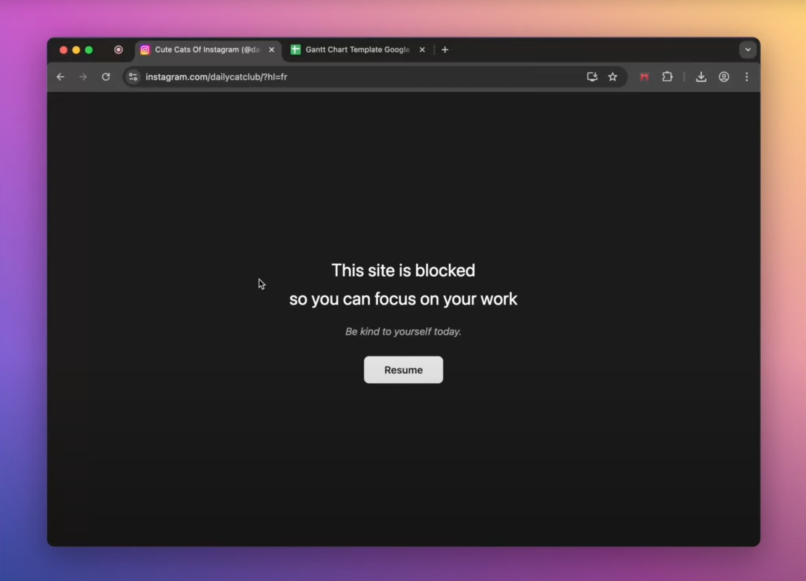

# Curtains

Block distracting websites with a peaceful curtain overlay. Get motivated, stay focused, and control your browsing time.

## Demo



Watch the extension in action:

[](https://www.youtube.com/watch?v=sqQr-KROUPg)

## Tech Stack

- **TypeScript** - Type-safe development
- **Vite** - Fast builds with HMR
- **Biome** - Lightning-fast linting & formatting
- **Vanilla DOM** - Zero framework overhead

## Development

### Setup

```bash
npm install
```

### Development Mode (with HMR)

```bash
npm run dev
```

Auto-reloads on file changes. The fastest way to develop.

### Build for Production

```bash
npm run build
```

Optimized build output in `dist/` folder.

### Package for Distribution

```bash
npm run package
```

Creates a timestamped, production-ready ZIP file in the `release/` folder, ready for Chrome Web Store submission.

### Linting & Formatting

```bash
npm run lint          # Check for issues
npm run lint:fix      # Fix issues automatically
npm run format        # Format code
```

## Loading the Extension

1. Build: `npm run build`
2. Go to `chrome://extensions/`
3. Enable "Developer mode"
4. Click "Load unpacked"
5. Select the `dist/` folder

### Making Keyboard Shortcuts Global (Recommended)

By default, keyboard shortcuts only work within the browser. To make them work globally (even when the browser is in the background):

1. Go to `chrome://extensions/shortcuts`
2. Find "Curtains" extension
3. Change the scope from "In Chrome/Chromium" to "Global"
4. Now `Command+Shift+H` (Mac) or `Ctrl+Shift+H` (Windows/Linux) works system-wide

## Features

- **Per-domain blocking**: Block youtube.com once, it's blocked in all tabs
- **Persistent state**: Blocked sites stay blocked across browser restarts
- **Auto-sync**: Block a site in one tab, all tabs with that domain are blocked
- **Tab muting**: Blocked tabs are automatically muted
- **Keyboard shortcuts**: `Ctrl+Shift+H` (Windows/Linux) or `Command+Shift+H` (Mac)

## Why This Stack?

- ✅ **Minimal code** - No framework bloat
- ✅ **Type safety** - Catch bugs before runtime
- ✅ **Fast builds** - Vite is 10-100x faster than Webpack
- ✅ **Modern tooling** - HMR, optimized bundles
- ✅ **Best DX** - Biome is 100x faster than ESLint

## Contributing

Contributions are welcome! Please check out the [issues](https://github.com/JeromeGsq/curtains-extension/issues) or submit a pull request.

## Author

**JeromeGsq**

- GitHub: [@JeromeGsq](https://github.com/JeromeGsq)
- Support: [Buy Me a Coffee](https://buymeacoffee.com/jeromegsq)

## License

ISC License

## Keywords

`chrome-extension` `productivity` `focus` `website-blocker` `distraction-blocker`
